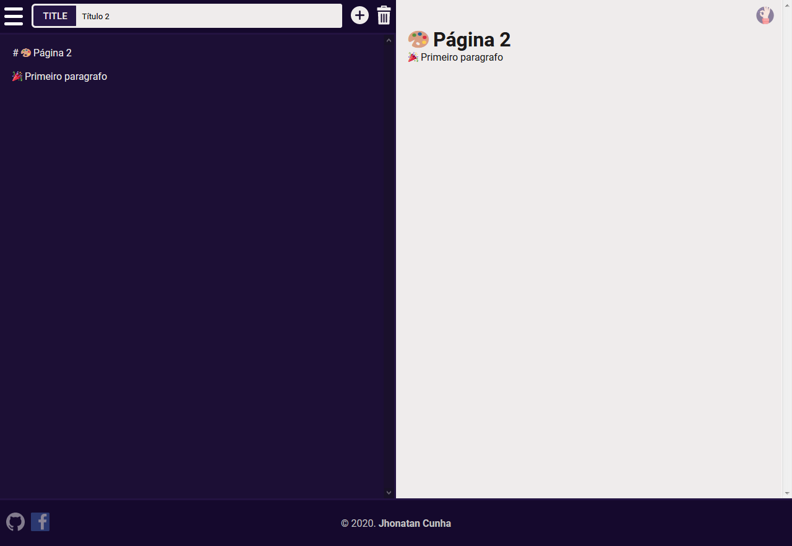
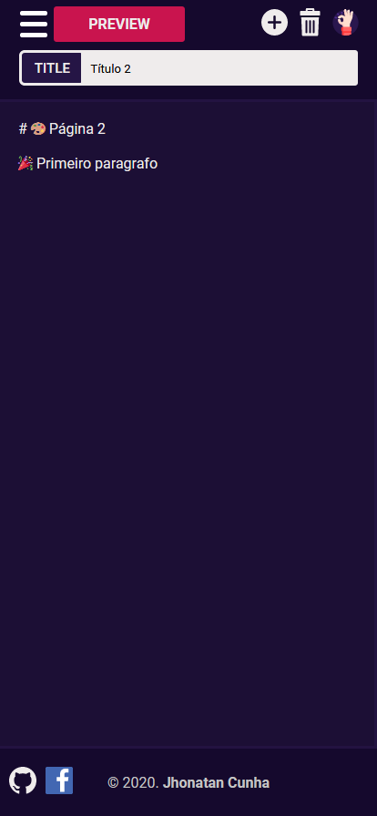
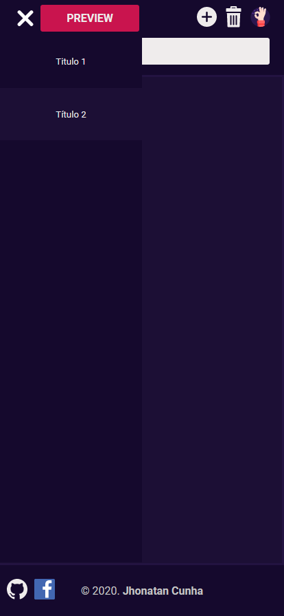
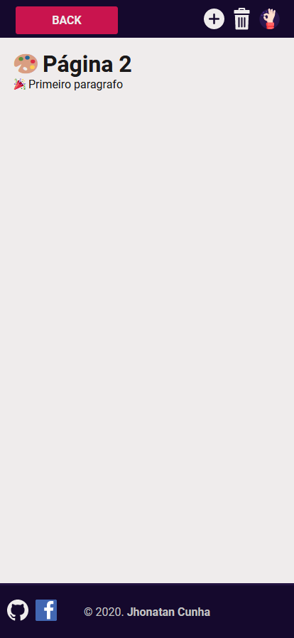

<h1 align="center">MarkDown Editor<h1>
<p align="center">


</p>

<br>


## :ballot_box_with_check: Demo Live
- [Netlify - Clique Aqui](https://markdowneditorfree.netlify.app/)

## :bookmark: Sobre


<p align="center">
    Editor de markdown criado para facilitar a criação e visualização de arquivos em tempo real.
</p>

<br>

# :computer: Web View
<p align="center">
    
    
</p>

# :iphone: Mobile View

<table align="center">
    <tr>
        <td></td>
        <td></td>
        <td></td>
    </tr>
 </table>


## 🚀 Tecnologias

- [ReactJS](https://pt-br.reactjs.org/)
- [Create React App](https://pt-br.reactjs.org/docs/create-a-new-react-app.html)
- [StoryBook](https://storybook.js.org/)
- [Styled-Components](https://styled-components.com/)

## ❓ Como utilizar?

### Instalação

```bash
$ cd markdown-editor
$ yarn
$ yarn start
```

# :ballot_box_with_check: Icons

- [Saved Icon](https://www.flaticon.com/free-icon/okay_1786608?term=ok&page=1&position=38)

- [Delete Icon](https://www.flaticon.com/free-icon/rubbish_447002?term=delete&page=1&position=27)

- [Warning Icon](https://www.flaticon.com/free-icon/warning_1680012?term=attention&page=1&position=18)

- [Favicon](https://www.flaticon.com/free-icon/text_2899289?term=editor&page=1&position=47)


<p align="center">
Made with :coffee: por :copyright: Jhonatan Cunha.
</p>
